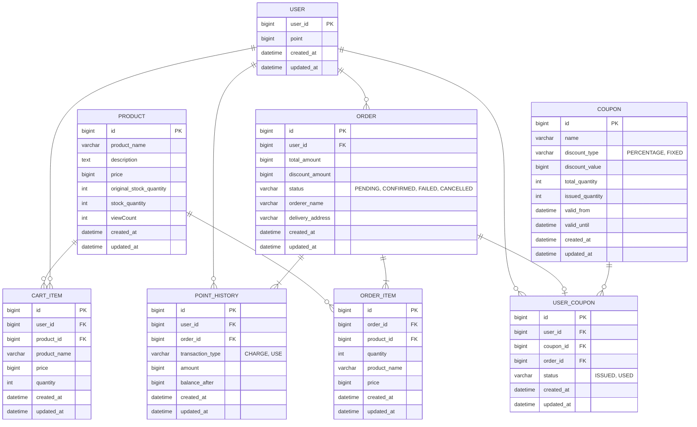
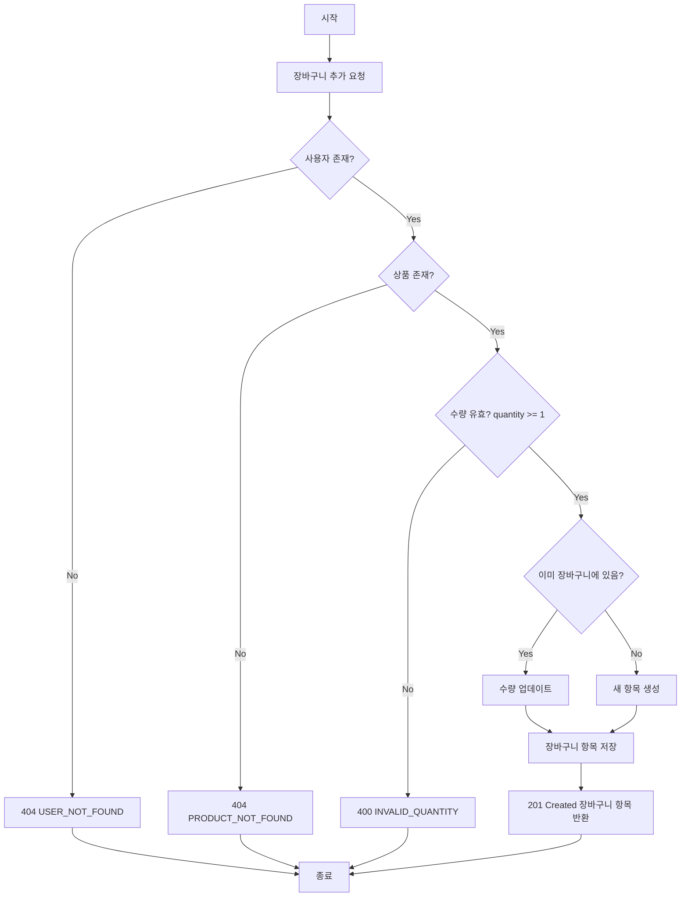
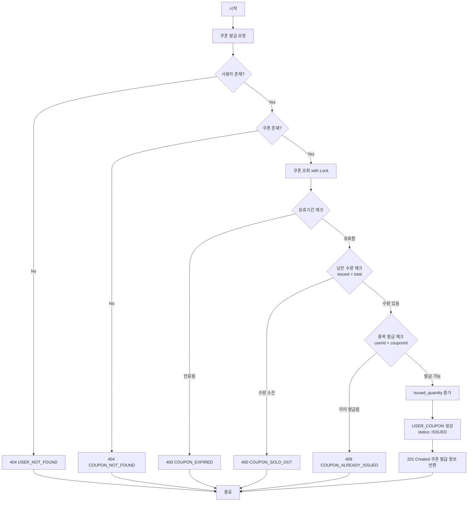
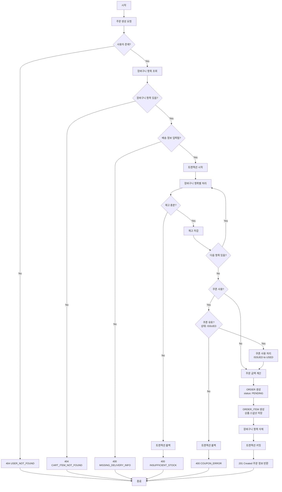
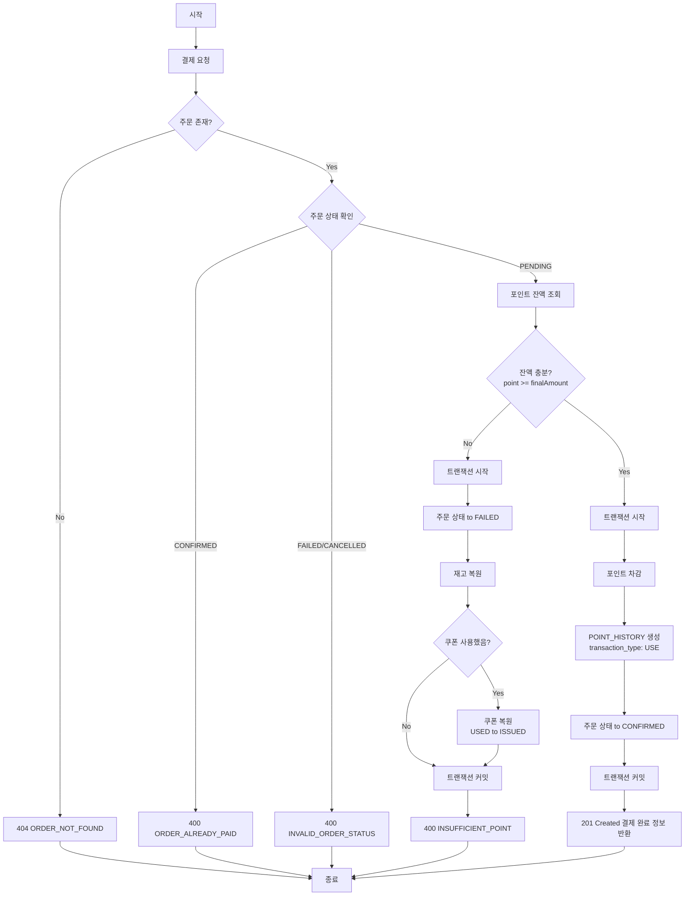

# 항해플러스 이커머스 프로젝트

이 프로젝트는 Spring Boot 기반의 이커머스 플랫폼입니다. 상품 관리, 장바구니, 주문, 결제, 쿠폰, 포인트 시스템을 포함합니다.

## 목차
- [요구사항 정의서](#요구사항-정의서)
- [ERD](#erd-entity-relationship-diagram)
- [API 명세서](#api-명세서)
- [시퀀스 다이어그램](#시퀀스-다이어그램)
- [플로우차트](#플로우차트)
- [동시성 제어](#동시성-제어-분석)

---

# 요구사항 정의서

### 1. 사용자 관리
- 사용자 시스템은 기능 고도화의 편의성을 위해 생략한다

### 2. 상품 관리
- **(1) 상품 정보 조회**
  - 사용자는 등록된 상품의 정보를 조회할 수 있다
  - 상품의 옵션과 카테고리는 생략한다

- **(2) 상품 재고 조회**
  - 사용자는 실시간으로 상품의 재고를 조회할 수 있다

- **(3) 인기 상품 통계 조회**
  - 사용자는 인기 상품의 통계를 조회할 수 있다
  - 지난 3일 간의 인기 상품을 5개까지 조회한다

### 3. 포인트 관리
- **(1) 포인트 조회**
  - 사용자는 잔여 포인트를 조회할 수 있다

- **(2) 포인트 사용**
  - 사용자는 포인트를 사용할 수 있다

### 4. 장바구니 관리
- **(1) 장바구니 담기**
  - 사용자는 상품을 장바구니에 담을 수 있다
  - 수량을 지정할 수 있다

- **(2) 장바구니 조회**
  - 사용자는 장바구니에 담긴 상품 목록을 조회할 수 있다

- **(3) 장바구니 수정/삭제**
  - 사용자는 장바구니 상품의 수량을 변경하거나 삭제할 수 있다

### 5. 주문 관리
- **(1) 주문 생성**
  - 사용자는 장바구니의 상품을 주문할 수 있다
  - 배송지 정보를 입력한다
  - 주문 시 재고와 쿠폰이 차감된다

- **(2) 주문 정보 조회**
  - 사용자는 자신의 주문 내역을 조회할 수 있다
  - 주문 상태(대기, 실패, 취소, 완료)를 확인할 수 있다

### 6. 결제 관리
- **(1) 결제 처리**
  - 사용자는 주문에 대한 결제를 진행할 수 있다
  - 결제 수단은 포인트로 제한한다
  - 결제에 실패하면 재고와 쿠폰을 복원한다

### 7. 쿠폰 관리
- **(1) 쿠폰 발급**
  - 사용자는 쿠폰을 발급받을 수 있다
  - 쿠폰의 개수는 제한되어 있으며, 선착순으로 인당 하나씩만 발급받을 수 있다

- **(2) 쿠폰 조회**
  - 사용자는 발급받은 쿠폰을 조회할 수 있다

- **(3) 쿠폰 사용**
  - 사용자는 주문시 쿠폰을 사용할 수 있다
---

# ERD (Entity Relationship Diagram)

## 엔티티 관계도



## 비즈니스 로직 노트

### 주문 및 결제 프로세스
1. **주문 생성 (트랜잭션)**
   - 재고 차감 (PRODUCT.stock_quantity)
   - 쿠폰 사용 처리 (USER_COUPON.status = USED, used_at 설정)
   - 주문 생성 (ORDER.status = PENDING)
   - ORDER_ITEM 생성 (주문 당시 상품명/가격 스냅샷)

2. **포인트 결제 처리 (트랜잭션)**
   - 포인트 잔액 검증 (USER.point >= 결제 금액)
   - 포인트 차감 (USER.point)
   - 포인트 이력 생성 (POINT_HISTORY: transaction_type = USE, amount = -결제금액)
   - 성공: ORDER.status = CONFIRMED
   - 실패: 보상 트랜잭션 (재고 복원, 쿠폰 복원, 포인트 복원, ORDER.status = FAILED)

### 쿠폰 발급 프로세스 (선착순)
1. COUPON.issued_quantity < COUPON.total_quantity 체크 (낙관적 락)
2. USER_COUPON에 중복 발급 체크 (UNIQUE 인덱스)
3. COUPON.issued_quantity 증가
4. USER_COUPON 생성 (status = ISSUED, issued_at 설정)
5. 쿠폰 유효기간 체크 (valid_from <= NOW() <= valid_until)

### 포인트 관리 프로세스
1. **포인트 조회**
   - 현재 잔액: USER.point 조회
   - 거래 이력: POINT_HISTORY 조회 (user_id 기준)

2. **포인트 충전**
   - USER.point 증가
   - POINT_HISTORY 생성 (transaction_type = CHARGE)

3. **포인트 사용**
   - 결제 시 USER.point 차감
   - POINT_HISTORY 생성 (transaction_type = USE)

4. **포인트 환불**
   - USER.point 증가
   - POINT_HISTORY 생성 (transaction_type = REFUND)

### 인기 상품 통계
- ORDER_ITEM 테이블에서 created_at 기준 최근 3일 데이터 집계
- product_id별 quantity 합산 후 상위 5개 조회

```sql
SELECT
    op.product_id,
    p.product_name,
    SUM(op.quantity) as total_quantity
FROM ORDER_ITEM op
JOIN PRODUCT p ON op.product_id = p.product_id
WHERE op.created_at >= DATE_SUB(NOW(), INTERVAL 3 DAY)
GROUP BY op.product_id, p.product_name
ORDER BY total_quantity DESC
LIMIT 5;
```
---

# swagger-api

https://kimujin99.github.io/hhplus10_w2/

---

# API 명세서

## 개요
- **Base URL**: `http://localhost:8080/api/v1`
- **API Version**: v1
- **Content-Type**: `application/json`

---

## 공통 응답 형식

모든 API는 다음 형식의 응답을 반환합니다.

### 성공 응답
```json
{
  "success": true,
  "data": {
    "productId": 1,
    "productName": "상품명",
    "description": "상세한 상품 설명...",
    "price": 29900,
    "stockQuantity": 100,
    "viewCount": 45
  },
  "error": null
}
```

### 실패 응답
```json
{
  "success": false,
  "data": null,
  "error": {
    "code": "PRODUCT_NOT_FOUND",
    "message": "상품을 찾을 수 없습니다"
  }
}
```

### 비즈니스 에러 코드

| HTTP Status | Error Code | Description |
|-------------|------------|------------|
| 400 | INVALID_INPUT | 입력값이 유효하지 않음 |
| 400 | INVALID_QUANTITY | 수량이 유효하지 않음 (0 이하) |
| 400 | INSUFFICIENT_STOCK | 재고 부족 |
| 400 | INSUFFICIENT_POINT | 포인트 잔액 부족 |
| 400 | INVALID_CHARGE_AMOUNT | 충전 금액이 유효하지 않음 |
| 400 | COUPON_SOLD_OUT | 쿠폰 발급 마감 |
| 400 | COUPON_EXPIRED | 쿠폰 유효 기간 만료 |
| 400 | COUPON_ALREADY_USED | 이미 사용된 쿠폰 |
| 400 | INVALID_COUPON_STATUS | 사용할 수 없는 쿠폰 상태 |
| 400 | ORDER_ALREADY_PAID | 이미 결제된 주문 |
| 400 | INVALID_ORDER_STATUS | 결제할 수 없는 주문 상태 |
| 400 | MISSING_DELIVERY_INFO | 배송 정보 누락 |
| 403 | FORBIDDEN_RESOURCE | 접근 권한 없음 |
| 404 | USER_NOT_FOUND | 사용자를 찾을 수 없음 |
| 404 | PRODUCT_NOT_FOUND | 상품을 찾을 수 없음 |
| 404 | CART_ITEM_NOT_FOUND | 장바구니 항목을 찾을 수 없음 |
| 404 | COUPON_NOT_FOUND | 쿠폰을 찾을 수 없음 |
| 404 | ORDER_NOT_FOUND | 주문을 찾을 수 없음 |
| 409 | COUPON_ALREADY_ISSUED | 이미 발급받은 쿠폰 |
| 500 | INTERNAL_SERVER_ERROR | 서버 내부 오류 |

---

## 1. 상품 (Products)

### 1.1 상품 목록 조회
**GET** `/products`

상품 목록을 조회합니다.

**Response** `200 OK`
```json
{
  "success": true,
  "data": [
    {
      "productId": 1,
      "productName": "상품명",
      "description": "상세한 상품 설명...",
      "price": 29900,
      "stockQuantity": 100,
      "viewCount": 45
    }
  ],
  "error": null
}
```

---

### 1.2 상품 상세 조회
**GET** `/products/{productId}`

특정 상품의 상세 정보를 조회합니다. 조회 시 viewCount가 증가합니다.

**Path Parameters**
- `productId`: 상품 ID

**Response** `200 OK`
```json
{
  "success": true,
  "data": {
    "productId": 1,
    "productName": "상품명",
    "description": "상세한 상품 설명...",
    "price": 29900,
    "stockQuantity": 100,
    "viewCount": 45
  },
  "error": null
}
```

**Error Responses**

- `404`, `PRODUCT_NOT_FOUND`: 상품을 찾을 수 없습니다

---

### 1.3 상품 재고 조회
**GET** `/products/{productId}/stock`

상품의 실시간 재고를 조회합니다.

**Path Parameters**
- `productId`: 상품 ID

**Response** `200 OK`
```json
{
  "success": true,
  "data": {
    "productId": 1,
    "stockQuantity": 100
  },
  "error": null
}
```

**Error Responses**

- `404`, `PRODUCT_NOT_FOUND`: 상품을 찾을 수 없습니다

---

### 1.4 인기 상품 조회
**GET** `/products/popular`

조회수 및 판매율 기반 상위 5개의 인기 상품을 조회합니다.
인기도 계산: 조회수 1포인트 + 판매율 2포인트

**Response** `200 OK`
```json
{
  "success": true,
  "data": [
    {
      "productId": 1,
      "productName": "인기 상품 1",
      "viewCount": 150
    },
    {
      "productId": 5,
      "productName": "인기 상품 2",
      "viewCount": 120
    }
  ],
  "error": null
}
```

---

## 2. 포인트 (Points)

### 2.1 포인트 조회
**GET** `/users/{userId}/points`

사용자의 현재 포인트 잔액을 조회합니다.

**Path Parameters**
- `userId`: 사용자 ID

**Response** `200 OK`
```json
{
  "success": true,
  "data": {
    "userId": 1,
    "point": 50000
  },
  "error": null
}
```

**Error Responses**

- `404`, `USER_NOT_FOUND`: 사용자를 찾을 수 없습니다

---

### 2.2 포인트 사용 내역 조회
**GET** `/users/{userId}/points/history`

사용자의 포인트 거래 내역을 조회합니다.

**Path Parameters**
- `userId`: 사용자 ID

**Response** `200 OK`
```json
{
  "success": true,
  "data": [
    {
      "pointHistoryId": 1,
      "userId": 1,
      "orderId": 5,
      "transactionType": "USE",
      "amount": 29900,
      "balanceAfter": 120100,
      "createdAt": "2024-01-20T16:40:00"
    },
    {
      "pointHistoryId": 2,
      "userId": 1,
      "orderId": null,
      "transactionType": "CHARGE",
      "amount": 100000,
      "balanceAfter": 150000,
      "createdAt": "2024-01-20T11:00:00"
    }
  ],
  "error": null
}
```

**Error Responses**

- `404`, `USER_NOT_FOUND`: 사용자를 찾을 수 없습니다

---

### 2.3 포인트 충전
**POST** `/users/{userId}/points/charge`

사용자의 포인트를 충전합니다.

**Path Parameters**
- `userId`: 사용자 ID

**Request Body**
```json
{
  "amount": 100000
}
```

**Response** `200 OK`
```json
{
  "success": true,
  "data": {
    "userId": 1,
    "point": 150000
  },
  "error": null
}
```

**Error Responses**

- `404`, `USER_NOT_FOUND`: 사용자를 찾을 수 없습니다
- `400`, `INVALID_CHARGE_AMOUNT`: 충전 금액이 유효하지 않습니다

---

## 3. 장바구니 (Cart)

### 3.1 장바구니 조회
**GET** `/users/{userId}/cart`

사용자의 장바구니를 조회합니다.

**Path Parameters**
- `userId`: 사용자 ID

**Response** `200 OK`
```json
{
  "success": true,
  "data": [
    {
      "cartItemId": 1,
      "userId": 1,
      "productId": 1,
      "productName": "상품명",
      "price": 29900,
      "quantity": 2,
      "subtotal": 59800
    }
  ],
  "error": null
}
```

**Error Responses**

- `404`, `USER_NOT_FOUND`: 사용자를 찾을 수 없습니다

---

### 3.2 장바구니에 상품 추가
**POST** `/users/{userId}/cart`

장바구니에 상품을 추가합니다. 이미 존재하는 상품인 경우 수량이 증가합니다.

**Path Parameters**
- `userId`: 사용자 ID

**Request Body**
```json
{
  "productId": 1,
  "quantity": 2
}
```

**Response** `200 OK`
```json
{
  "success": true,
  "data": {
    "cartItemId": 1,
    "userId": 1,
    "productId": 1,
    "productName": "상품명",
    "price": 29900,
    "quantity": 2,
    "subtotal": 59800
  },
  "error": null
}
```

**Error Responses**

- `404`, `USER_NOT_FOUND`: 사용자를 찾을 수 없습니다
- `404`, `PRODUCT_NOT_FOUND`: 상품을 찾을 수 없습니다
- `400`, `INVALID_QUANTITY`: 수량은 1개 이상이어야 합니다

---

### 3.3 장바구니 상품 삭제
**DELETE** `/cart/{cartItemId}`

장바구니에서 상품을 삭제합니다.

**Path Parameters**
- `cartItemId`: 장바구니 항목 ID

**Response** `200 OK`
```json
{
  "success": true,
  "data": null,
  "error": null
}
```

**Error Responses**

- `404`, `CART_ITEM_NOT_FOUND`: 장바구니 항목을 찾을 수 없습니다

---

## 4. 쿠폰 (Coupons)

### 4.1 발급 가능한 쿠폰 목록 조회
**GET** `/coupons`

현재 발급 가능한 쿠폰 목록을 조회합니다.

**Response** `200 OK`
```json
{
  "success": true,
  "data": [
    {
      "couponId": 1,
      "name": "신규 가입 쿠폰",
      "discountType": "FIXED",
      "discountValue": 5000,
      "totalQuantity": 100,
      "issuedQuantity": 45,
      "remainingQuantity": 55,
      "validFrom": "2024-01-01T00:00:00",
      "validUntil": "2024-12-31T23:59:59"
    },
    {
      "couponId": 2,
      "name": "10% 할인 쿠폰",
      "discountType": "PERCENTAGE",
      "discountValue": 10,
      "totalQuantity": 50,
      "issuedQuantity": 50,
      "remainingQuantity": 0,
      "validFrom": "2024-01-15T00:00:00",
      "validUntil": "2024-01-31T23:59:59"
    }
  ],
  "error": null
}
```

---

### 4.2 쿠폰 발급
**POST** `/users/{userId}/coupons`

사용자에게 쿠폰을 발급합니다. 선착순으로 인당 하나씩만 발급 가능합니다.

**Path Parameters**
- `userId`: 사용자 ID

**Request Body**
```json
{
  "couponId": 1
}
```

**Response** `200 OK`
```json
{
  "success": true,
  "data": {
    "userCouponId": 1,
    "userId": 1,
    "couponId": 1,
    "couponName": "신규 가입 쿠폰",
    "discountType": "FIXED",
    "discountValue": 5000,
    "validFrom": "2024-01-01T00:00:00",
    "validUntil": "2024-12-31T23:59:59",
    "status": "ISSUED",
    "issuedAt": "2024-01-20T15:00:00"
  },
  "error": null
}
```

**Error Responses**

- `404`, `USER_NOT_FOUND`: 사용자를 찾을 수 없습니다
- `404`, `COUPON_NOT_FOUND`: 쿠폰을 찾을 수 없습니다
- `409`, `COUPON_ALREADY_ISSUED`: 이미 발급받은 쿠폰입니다
- `400`, `COUPON_SOLD_OUT`: 쿠폰 발급이 마감되었습니다
- `400`, `COUPON_EXPIRED`: 쿠폰 유효 기간이 아닙니다

---

### 4.3 사용자 쿠폰 목록 조회
**GET** `/users/{userId}/coupons`

사용자가 보유한 쿠폰 목록을 조회합니다.

**Path Parameters**
- `userId`: 사용자 ID

**Response** `200 OK`
```json
{
  "success": true,
  "data": [
    {
      "userCouponId": 1,
      "userId": 1,
      "couponId": 1,
      "couponName": "신규 가입 쿠폰",
      "discountType": "FIXED",
      "discountValue": 5000,
      "validFrom": "2024-01-01T00:00:00",
      "validUntil": "2024-12-31T23:59:59",
      "status": "ISSUED",
      "issuedAt": "2024-01-20T15:00:00"
    },
    {
      "userCouponId": 2,
      "userId": 1,
      "couponId": 2,
      "couponName": "10% 할인 쿠폰",
      "discountType": "PERCENTAGE",
      "discountValue": 10,
      "validFrom": "2024-01-01T00:00:00",
      "validUntil": "2024-12-31T23:59:59",
      "status": "USED",
      "issuedAt": "2024-01-20T15:00:00"
    }
  ],
  "error": null
}
```

**Error Responses**

- `404`, `USER_NOT_FOUND`: 사용자를 찾을 수 없습니다

---

## 5. 주문 (Orders)

### 5.1 주문 생성
**POST** `/orders`

장바구니의 상품으로 주문을 생성합니다. 주문 시 재고와 쿠폰이 차감됩니다.

**Request Body**
```json
{
  "userId": 1,
  "ordererName": "홍길동",
  "deliveryAddress": "서울시 강남구 테헤란로 123",
  "userCouponId": 1
}
```

**Response** `200 OK`
```json
{
  "success": true,
  "data": {
    "orderId": 1,
    "userId": 1,
    "totalAmount": 59800,
    "discountAmount": 5000,
    "finalAmount": 54800,
    "status": "PENDING",
    "ordererName": "홍길동",
    "deliveryAddress": "서울시 강남구 테헤란로 123",
    "orderItems": [
      {
        "orderItemId": 1,
        "productId": 1,
        "productName": "상품명",
        "price": 29900,
        "quantity": 2,
        "subtotal": 59800
      }
    ],
    "createdAt": "2024-01-20T16:30:00"
  },
  "error": null
}
```

**Error Responses**

- `404`, `USER_NOT_FOUND`: 사용자를 찾을 수 없습니다
- `404`, `CART_ITEM_NOT_FOUND`: 장바구니 항목을 찾을 수 없습니다
- `404`, `COUPON_NOT_FOUND`: 쿠폰을 찾을 수 없습니다
- `400`, `INSUFFICIENT_STOCK`: 상품 재고가 부족합니다
- `400`, `COUPON_ALREADY_USED`: 이미 사용된 쿠폰입니다
- `400`, `COUPON_EXPIRED`: 쿠폰 유효 기간이 만료되었습니다
- `400`, `MISSING_DELIVERY_INFO`: 배송 정보를 입력해주세요

---

### 5.2 주문 목록 조회
**GET** `/users/{userId}/orders`

사용자의 주문 목록을 조회합니다.

**Path Parameters**
- `userId`: 사용자 ID

**Response** `200 OK`
```json
{
  "success": true,
  "data": [
    {
      "orderId": 1,
      "totalAmount": 59800,
      "discountAmount": 5000,
      "finalAmount": 54800,
      "status": "CONFIRMED",
      "createdAt": "2024-01-20T16:30:00"
    }
  ],
  "error": null
}
```

**Error Responses**

- `404`, `USER_NOT_FOUND`: 사용자를 찾을 수 없습니다

---

### 5.3 주문 상세 조회
**GET** `/users/{userId}/orders/{orderId}`

주문의 상세 정보를 조회합니다.

**Path Parameters**
- `userId`: 사용자 ID
- `orderId`: 주문 ID

**Response** `200 OK`
```json
{
  "success": true,
  "data": {
    "orderId": 1,
    "userId": 1,
    "totalAmount": 59800,
    "discountAmount": 5000,
    "finalAmount": 54800,
    "status": "CONFIRMED",
    "ordererName": "홍길동",
    "deliveryAddress": "서울시 강남구 테헤란로 123",
    "orderItems": [
      {
        "orderItemId": 1,
        "productId": 1,
        "productName": "상품명",
        "price": 29900,
        "quantity": 2,
        "subtotal": 59800
      }
    ],
    "createdAt": "2024-01-20T16:30:00"
  },
  "error": null
}
```

**Error Responses**

- `404`, `ORDER_NOT_FOUND`: 주문을 찾을 수 없습니다
- `403`, `FORBIDDEN_RESOURCE`: 해당 주문에 대한 접근 권한이 없습니다

---

## 6. 결제 (Payments)

### 6.1 결제 생성
**POST** `/orders/{orderId}/payments`

주문에 대한 포인트 결제를 생성합니다. 결제 실패 시 재고와 쿠폰이 복원됩니다.

**Path Parameters**
- `orderId`: 주문 ID

**Response** `200 OK`
```json
{
  "success": true,
  "data": {
    "orderId": 1,
    "paymentAmount": 54800,
    "status": "CONFIRMED",
    "paidAt": "2024-01-20T16:35:00"
  },
  "error": null
}
```

**Error Responses**

- `404`, `ORDER_NOT_FOUND`: 주문을 찾을 수 없습니다
- `400`, `INSUFFICIENT_POINT`: 포인트 잔액이 부족합니다
- `400`, `ORDER_ALREADY_PAID`: 이미 결제된 주문입니다
- `400`, `INVALID_ORDER_STATUS`: 결제할 수 없는 주문 상태입니다

**Note**: 결제 실패 시 자동으로 다음 작업이 수행됩니다:
- 주문 상태가 `FAILED`로 변경
- 차감된 재고 복원
- 사용된 쿠폰 복원 (상태가 `ISSUED`로 변경)

---

## 비즈니스 로직 플로우

### 주문 및 결제 프로세스

1. **주문 생성** (`POST /orders`)
    - 장바구니 항목 검증
    - 재고 확인 및 차감
    - 쿠폰 적용 (선택적)
    - 쿠폰 사용 처리 (status: ISSUED → USED)
    - 주문 생성 (status: PENDING)
    - 주문 항목에 상품 스냅샷 저장

2. **결제 생성** (`POST /orders/{orderId}/payments`)
    - 포인트 잔액 검증
    - 포인트 차감
    - 포인트 거래 내역 생성 (transaction_type: USE)
    - 성공 시: 주문 상태 → CONFIRMED
    - 실패 시: 보상 트랜잭션 (재고 복원, 쿠폰 복원, 주문 상태 → FAILED)

### 쿠폰 발급 프로세스 (선착순)

1. **쿠폰 발급** (`POST /users/{userId}/coupons`)
    - 쿠폰 유효기간 검증
    - 남은 수량 검증 (issued_quantity < total_quantity)
    - 중복 발급 검증 (user_id + coupon_id 유니크)
    - 동시성 제어: ReentrantLock을 사용한 쿠폰별 Lock
    - issued_quantity 증가
    - USER_COUPON 생성 (status: ISSUED)

### 장바구니 관리

1. **장바구니 상품 추가** (`POST /users/{userId}/cart`)
    - 상품 존재 여부 확인
    - 이미 장바구니에 있는 상품인 경우 수량 증가
    - 새로운 상품인 경우 장바구니 항목 생성

### 인기 상품 집계

1. **인기 상품 조회** (`GET /products/popular`)
    - 인기도 계산: 조회수 1포인트 + 판매율 2포인트
    - 판매율 = (판매량 / 초기 재고량) × 100
    - 상위 5개 상품 조회

---

# 플로우차트

## 1. 장바구니 추가



## 2. 쿠폰 발급 (선착순)



## 3. 주문 생성



## 4. 결제 처리



---

# 동시성 제어 분석

## 동시성 제어 방식

### 1. Mutex / Lock
- **원리**: 한 시점에 오직 하나의 스레드만 임계 구역(critical section)에 접근하도록 제한하는 전통적인 방식.  
  Java에서는 `synchronized`, `ReentrantLock` 등이 대표적이다.
- **대표 기능 (`ReentrantLock`)**: 재진입(reentrant)이 가능하며, 같은 스레드가 여러 번 락을 획득할 수 있다.
- **장점**: 구현이 직관적이며, 여러 상태를 원자적으로 묶어야 할 때 유리하다.
- **단점**: 락을 잘못 해제하거나 경쟁이 과도할 경우 데드락 또는 성능 병목이 발생할 수 있다.
- **적용**: 복수의 상태(여러 변수를 함께 갱신)에서 원자성이 필요한 경우에 적합하다.

---

### 2. Semaphore
- **원리**: 동시에 접근할 수 있는 스레드 수(permit)를 지정해, 특정 자원에 대한 접근을 제한한다.
- **장점**: 리소스 풀(DB 커넥션, 스레드 등)의 동시 접근 제한에 적합하다.
- **단점**: permit을 반환하지 않는 실수로 교착 상태가 발생할 수 있다.
- **적용**: 세밀한 상호 배제보다는 자원 수 제어(예: API 요청 제한, 커넥션 풀)에 주로 사용된다.

---

### 3. Atomic Operations
- **원리**: 하드웨어 수준의 CAS(Compare-And-Swap)를 이용해 락 없이 원자적 연산을 수행한다.  
  Java의 `AtomicInteger`, `AtomicReference`, `LongAdder` 등이 이에 해당한다.
- **장점**: 락 오버헤드가 없어 경쟁이 적을 때 빠르다.
- **단점**: 단일 변수 수준에서만 원자성을 보장하며, 여러 상태를 함께 다루는 경우엔 부적합하다.
- **적용**: 단일 카운터, ID 생성기, 상태 플래그 등 **단일 변수 갱신**에 매우 적합하다.

---

### 4. Queue 기반
- **원리**: 요청을 큐에 넣고(생산자), 소비자가 순서대로 처리함으로써 동시성 문제를 단순화한다.  
  Java의 `BlockingQueue`, `ConcurrentLinkedQueue` 등이 이에 해당한다.
- **장점**: 요청 순서를 보장하며, 비동기/이벤트 기반 구조에 적합하다.
- **단점**: 큐에 요청이 쌓이면서 **지연(latency)** 이 발생할 수 있고, 단일 소비자 모델에서는 병목이 생길 수 있다.
- **적용**: 비동기 작업, 선착순 이벤트, 생산자-소비자 패턴, 처리량 제어 등에 활용된다.

---

## 쿠폰 발급 동시성 제어

### 1. 적용 사례
- **AtomicInteger**  
  인메모리 환경에서 쿠폰의 ID 생성에 사용했다.  
  단일 카운터에는 적합하지만, 여러 데이터에 접근해야 하는 복합 상태의 일관성은 보장하지 못하므로, 핵심 동시성 제어 방식으로는 사용하지 않았다.

- **ReentrantLock**  
  쿠폰 단위(couponId)로 락을 걸어 한 시점에 한 스레드만 특정 쿠폰을 발급하도록 했다.  
  사용자 단위의 원자성까지는 보장되지 않지만, “한 유저가 동시에 여러 쿠폰을 발급받으면 안 된다”는 제약이 없기 때문에 쿠폰 재고의 일관성 보장에만 집중했다.  
  단일 서버 기반의 인메모리 환경에서, 구조를 단순하게 유지하면서도 쿠폰 중복 발급이나 재고 초과 문제를 예방하기 위해 ReentrantLock을 선택했다.

---

### 2. 미적용 사유
- **Semaphore**  
  동시에 접근 가능한 스레드 수를 제한하는 방식으로,  
  여러 스레드가 일정 개수까진 동시에 임계 구역에 진입할 수 있도록 한다.  
  쿠폰 발급 로직은 “한 시점에 한 스레드만” 특정 쿠폰을 차감해야 하는 완전한 상호 배제(Mutex) 가 필요하므로 사용하지 않았다.  
  (즉, 세마포어는 사실상 Lock과 동일하지만, 재진입이 불가능하다는 단점이 있다.)

- **Queue 기반 제어**  
  요청을 큐에 넣고 순차 처리하면 직렬화가 가능하지만,  
  큐 대기 과정에서 지연(latency) 이 발생하고,  
  쿠폰별로 큐를 따로 관리해야 하므로 구현과 운영이 복잡해진다.  
  또한 큐 기반 처리는 비동기 특성상 즉각적인 응답이 어렵기 때문에,  
  실시간성이 중요한 선착순 쿠폰 발급 시나리오에는 적합하지 않아 사용하지 않았다.

---