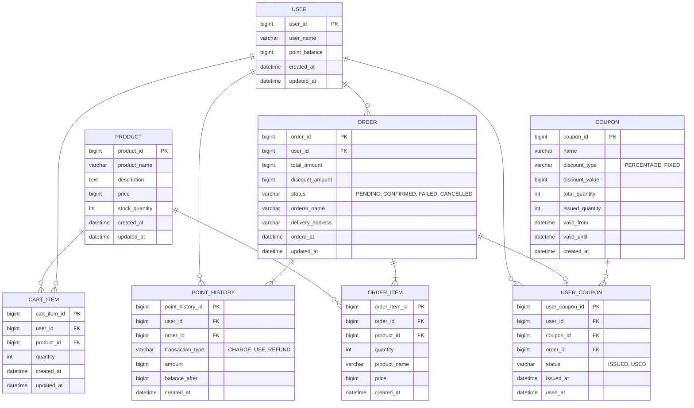

# 항해플러스 이커머스 프로젝트

이 프로젝트는 Spring Boot 기반의 이커머스 플랫폼입니다. 상품 관리, 장바구니, 주문, 결제, 쿠폰, 포인트 시스템을 포함합니다.

## 목차
- [요구사항 정의서](#요구사항-정의서)
- [ERD](#erd-entity-relationship-diagram)
- [API 명세서](#api-명세서)
- [시퀀스 다이어그램](#시퀀스-다이어그램)
- [플로우차트](#플로우차트)

---

# 요구사항 정의서

### 1. 사용자 관리
- 사용자 시스템은 기능 고도화의 편의성을 위해 생략한다

### 2. 상품 관리
- **(1) 상품 정보 조회**
  - 사용자는 등록된 상품의 정보를 조회할 수 있다
  - 상품의 옵션과 카테고리는 생략한다

- **(2) 상품 재고 조회**
  - 사용자는 실시간으로 상품의 재고를 조회할 수 있다

- **(3) 인기 상품 통계 조회**
  - 사용자는 인기 상품의 통계를 조회할 수 있다
  - 지난 3일 간의 인기 상품을 5개까지 조회한다

### 3. 포인트 관리
- **(1) 포인트 조회**
  - 사용자는 잔여 포인트를 조회할 수 있다

- **(2) 포인트 사용**
  - 사용자는 포인트를 사용할 수 있다

### 4. 장바구니 관리
- **(1) 장바구니 담기**
  - 사용자는 상품을 장바구니에 담을 수 있다
  - 수량을 지정할 수 있다

- **(2) 장바구니 조회**
  - 사용자는 장바구니에 담긴 상품 목록을 조회할 수 있다

- **(3) 장바구니 수정/삭제**
  - 사용자는 장바구니 상품의 수량을 변경하거나 삭제할 수 있다

### 5. 주문 관리
- **(1) 주문 생성**
  - 사용자는 장바구니의 상품을 주문할 수 있다
  - 배송지 정보를 입력한다
  - 주문 시 재고와 쿠폰이 차감된다

- **(2) 주문 정보 조회**
  - 사용자는 자신의 주문 내역을 조회할 수 있다
  - 주문 상태(대기, 실패, 취소, 완료)를 확인할 수 있다

### 6. 결제 관리
- **(1) 결제 처리**
  - 사용자는 주문에 대한 결제를 진행할 수 있다
  - 결제 수단은 포인트로 제한한다
  - 결제에 실패하면 재고와 쿠폰을 복원한다

### 7. 쿠폰 관리
- **(1) 쿠폰 발급**
  - 사용자는 쿠폰을 발급받을 수 있다
  - 쿠폰의 개수는 제한되어 있으며, 선착순으로 인당 하나씩만 발급받을 수 있다

- **(2) 쿠폰 조회**
  - 사용자는 발급받은 쿠폰을 조회할 수 있다

- **(3) 쿠폰 사용**
  - 사용자는 주문시 쿠폰을 사용할 수 있다
---

# ERD (Entity Relationship Diagram)

## 엔티티 관계도



## 테이블 상세 설명

### 1. USER (사용자)
- **Primary Key**: user_id
- **Description**: 사용자 정보를 저장하는 테이블
- **Fields**:
  - name: 사용자의 이름
  - point_balance: 사용자의 현재 포인트 잔액

### 2. ORDER (주문)
- **Primary Key**: order_id
- **Foreign Keys**: user_id → USER
- **Description**: 주문 정보 테이블
- **Fields**:
  - total_amount: 총 주문 금액
  - discount_amount: 쿠폰 할인 금액
  - status: 주문 상태
  - orderer_name: 주문자명
  - delivery_address: 배송지 주소
- **Status Values**:
  - PENDING (대기 - 주문 생성됨, 재고/쿠폰 차감됨)
  - CONFIRMED (완료 - 결제 완료)
  - FAILED (실패 - 결제 실패, 재고/쿠폰 복원됨)
  - CANCELLED (취소 - 사용자 취소)

### 3. PRODUCT (상품)
- **Primary Key**: product_id
- **Description**: 판매 상품 정보 테이블
- **Fields**:
  - product_name: 상품명
  - description: 상품 설명
  - price: 상품 가격
  - stock_quantity: 재고 수량
- **Note**:
  - stock_quantity는 재고 관리에 사용되며, 주문 시 차감됨
  - 카테고리 기능은 요구사항에 따라 생략됨

### 4. CART_ITEM (장바구니 항목)
- **Primary Key**: cart_item_id
- **Foreign Keys**:
  - user_id → USER
  - product_id → PRODUCT
- **Description**: 사용자의 장바구니 항목
- **Fields**:
  - quantity: 장바구니에 담은 수량
- **Note**: 같은 사용자-상품 조합은 유니크해야 함 (quantity로 수량 관리)

### 5. ORDER_ITEM (주문 상품)
- **Primary Key**: order_item_id
- **Foreign Keys**:
  - order_id → ORDER
  - product_id → PRODUCT
- **Description**: 주문에 포함된 개별 상품 정보
- **Fields**:
  - quantity: 주문 수량
  - product_name: 주문 당시 상품명 (스냅샷)
  - price: 주문 당시 상품 가격 (스냅샷)
- **Note**:
  - name과 price는 주문 당시의 값을 저장 (가격/상품명 변동 이력 보존)
  - 인기 상품 통계는 ORDER_ITEM의 created_at을 기준으로 집계

### 6. POINT_HISTORY (포인트 거래 이력)
- **Primary Key**: point_history_id
- **Foreign Keys**:
  - user_id → USER
  - order_id → ORDER (결제 시, nullable)
- **Description**: 포인트 충전/사용 이력 추적 테이블
- **Transaction Type Values**:
  - CHARGE (충전)
  - USE (사용)
  - REFUND (환불)
- **Fields**:
  - transaction_type: 거래 유형
  - amount: 거래 금액 (충전/환불은 양수, 사용은 음수)
  - balance_after: 거래 후 잔액 (포인트 이력 추적 및 검증용)
- **Note**:
  - 포인트 사용 내역 조회 가능
  - 감사(audit) 추적 및 포인트 정합성 검증에 활용
  - USER.point와 함께 사용하여 이중 검증

### 7. COUPON (쿠폰)
- **Primary Key**: coupon_id
- **Description**: 쿠폰 마스터 정보 테이블
- **Discount Type Values**:
  - PERCENTAGE (퍼센트 할인)
  - FIXED (고정 금액 할인)
- **Fields**:
  - name: 쿠폰명
  - discount_type: 할인 유형
  - discount_value: 할인 값 (퍼센트 또는 고정 금액)
  - total_quantity: 총 발급 가능 수량
  - issued_quantity: 현재까지 발급된 수량 (선착순 제어용)
  - valid_from: 쿠폰 유효 시작일
  - valid_until: 쿠폰 유효 종료일

### 8. USER_COUPON (사용자 쿠폰)
- **Primary Key**: user_coupon_id
- **Foreign Keys**:
  - user_id → USER
  - coupon_id → COUPON
  - order_id → ORDER (사용 시, nullable)
- **Description**: 사용자별 쿠폰 발급 및 사용 이력
- **Status Values**:
  - ISSUED (발급됨)
  - USED (사용됨)
- **Fields**:
  - status: 쿠폰 상태
  - issued_at: 발급 일시
  - used_at: 사용 일시
- **Note**:
  - 한 사용자는 같은 쿠폰을 한 번만 발급받을 수 있음 (user_id, coupon_id 조합 유니크)
  - 주문 생성 시 쿠폰을 사용 처리하고, 결제 실패 시 복원

## 인덱스 설계

```sql
-- CART_ITEM
CREATE INDEX idx_cart_user ON CART_ITEM(user_id);
CREATE UNIQUE INDEX idx_cart_user_product ON CART_ITEM(user_id, product_id);

-- ORDER
CREATE INDEX idx_order_user ON ORDER(user_id);
CREATE INDEX idx_order_status ON ORDER(status);
CREATE INDEX idx_order_date ON ORDER(orderd_at);

-- ORDER_ITEM
CREATE INDEX idx_order_item_order ON ORDER_ITEM(order_id);
CREATE INDEX idx_order_item_product ON ORDER_ITEM(product_id);
CREATE INDEX idx_order_item_created ON ORDER_ITEM(created_at); -- 인기 상품 통계용

-- POINT_HISTORY
CREATE INDEX idx_point_history_user ON POINT_HISTORY(user_id);
CREATE INDEX idx_point_history_user_created ON POINT_HISTORY(user_id, created_at); -- 사용자별 이력 조회 최적화

-- COUPON
CREATE INDEX idx_coupon_valid_period ON COUPON(valid_from, valid_until);

-- USER_COUPON
CREATE INDEX idx_user_coupon_user ON USER_COUPON(user_id);
CREATE INDEX idx_user_coupon_coupon ON USER_COUPON(coupon_id);
CREATE INDEX idx_user_coupon_status ON USER_COUPON(status);
CREATE UNIQUE INDEX idx_user_coupon_unique ON USER_COUPON(user_id, coupon_id); -- 중복 발급 방지
```

## 비즈니스 로직 노트

### 주문 및 결제 프로세스
1. **주문 생성 (트랜잭션)**
   - 재고 차감 (PRODUCT.stock_quantity)
   - 쿠폰 사용 처리 (USER_COUPON.status = USED, used_at 설정)
   - 주문 생성 (ORDER.status = PENDING)
   - ORDER_ITEM 생성 (주문 당시 상품명/가격 스냅샷)

2. **포인트 결제 처리 (트랜잭션)**
   - 포인트 잔액 검증 (USER.point >= 결제 금액)
   - 포인트 차감 (USER.point)
   - 포인트 이력 생성 (POINT_HISTORY: transaction_type = USE, amount = -결제금액)
   - 성공: ORDER.status = CONFIRMED
   - 실패: 보상 트랜잭션 (재고 복원, 쿠폰 복원, 포인트 복원, ORDER.status = FAILED)

### 쿠폰 발급 프로세스 (선착순)
1. COUPON.issued_quantity < COUPON.total_quantity 체크 (낙관적 락)
2. USER_COUPON에 중복 발급 체크 (UNIQUE 인덱스)
3. COUPON.issued_quantity 증가
4. USER_COUPON 생성 (status = ISSUED, issued_at 설정)
5. 쿠폰 유효기간 체크 (valid_from <= NOW() <= valid_until)

### 포인트 관리 프로세스
1. **포인트 조회**
   - 현재 잔액: USER.point 조회
   - 거래 이력: POINT_HISTORY 조회 (user_id 기준)

2. **포인트 충전**
   - USER.point 증가
   - POINT_HISTORY 생성 (transaction_type = CHARGE)

3. **포인트 사용**
   - 결제 시 USER.point 차감
   - POINT_HISTORY 생성 (transaction_type = USE)

4. **포인트 환불**
   - USER.point 증가
   - POINT_HISTORY 생성 (transaction_type = REFUND)

### 인기 상품 통계
- ORDER_ITEM 테이블에서 created_at 기준 최근 3일 데이터 집계
- product_id별 quantity 합산 후 상위 5개 조회

```sql
SELECT
    op.product_id,
    p.product_name,
    SUM(op.quantity) as total_quantity
FROM ORDER_ITEM op
JOIN PRODUCT p ON op.product_id = p.product_id
WHERE op.created_at >= DATE_SUB(NOW(), INTERVAL 3 DAY)
GROUP BY op.product_id, p.product_name
ORDER BY total_quantity DESC
LIMIT 5;
```
---

# API 명세서

## 개요
- **Base URL**: `http://localhost:8080/api/v1`
- **API Version**: v1
- **Content-Type**: `application/json`

---

## 공통 응답 형식

모든 API는 다음 형식의 응답을 반환합니다.

```json
{
  "timestamp": "2025-10-30T17:00:00",
  "path": "/api/v1/products",
  "success": true,
  "data": {
    "productId": 1,
    "productName": "상품명",
    "description": "상세한 상품 설명...",
    "price": 29900,
    "stockQuantity": 100
  },
  "error": null
}
```
```json
{
  "timestamp": "2025-10-30T17:00:00",
  "path": "/api/v1/products/999",
  "success": false,
  "data": null,
  "error": {
    "code": "PRODUCT_NOT_FOUND",
    "message": "상품을 찾을 수 없습니다"
  }
}
```

### 비즈니스 에러 코드

| HTTP Status | Error Code | Description |
|-------------|------------|------------|
| 400 | INVALID_INPUT | 입력값이 유효하지 않음 |
| 400 | INVALID_QUANTITY | 수량이 유효하지 않음 (0 이하) |
| 400 | INSUFFICIENT_STOCK | 재고 부족 |
| 400 | INSUFFICIENT_POINT | 포인트 잔액 부족 |
| 400 | INVALID_CHARGE_AMOUNT | 충전 금액이 유효하지 않음 |
| 400 | COUPON_SOLD_OUT | 쿠폰 발급 마감 |
| 400 | COUPON_EXPIRED | 쿠폰 유효 기간 만료 |
| 400 | COUPON_ALREADY_USED | 이미 사용된 쿠폰 |
| 400 | INVALID_COUPON_STATUS | 사용할 수 없는 쿠폰 상태 |
| 400 | ORDER_ALREADY_PAID | 이미 결제된 주문 |
| 400 | INVALID_ORDER_STATUS | 결제할 수 없는 주문 상태 |
| 400 | MISSING_DELIVERY_INFO | 배송 정보 누락 |
| 403 | FORBIDDEN_RESOURCE | 접근 권한 없음 |
| 404 | USER_NOT_FOUND | 사용자를 찾을 수 없음 |
| 404 | PRODUCT_NOT_FOUND | 상품을 찾을 수 없음 |
| 404 | CART_ITEM_NOT_FOUND | 장바구니 항목을 찾을 수 없음 |
| 404 | COUPON_NOT_FOUND | 쿠폰을 찾을 수 없음 |
| 404 | ORDER_NOT_FOUND | 주문을 찾을 수 없음 |
| 409 | COUPON_ALREADY_ISSUED | 이미 발급받은 쿠폰 |
| 500 | INTERNAL_SERVER_ERROR | 서버 내부 오류 |

---

## 1. 상품 (Products)

### 1.1 상품 목록 조회
**GET** `/products`

상품 목록을 조회합니다.

**Response** `200 OK`
```json
[
  {
    "productId": 1,
    "productName": "상품명",
    "description": "상세한 상품 설명...",
    "price": 29900,
    "stockQuantity": 100
  }
]
```

---

### 1.2 상품 상세 조회
**GET** `/products/{productId}`

특정 상품의 상세 정보를 조회합니다.

**Path Parameters**
- `productId`: 상품 ID

**Response** `200 OK`
```json
{
  "productId": 1,
  "productName": "상품명",
  "description": "상세한 상품 설명...",
  "price": 29900,
  "stockQuantity": 100
}
```

**Error Responses**

- `404`, `PRODUCT_NOT_FOUND`: 상품을 찾을 수 없습니다

---

### 1.3 상품 재고 조회
**GET** `/products/{productId}/stock`

상품의 실시간 재고를 조회합니다.

**Path Parameters**
- `productId`: 상품 ID

**Response** `200 OK`
```json
{
  "productId": 1,
  "productName": "상품명",
  "stockQuantity": 100
}
```

**Error Responses**

- `404`, `PRODUCT_NOT_FOUND`: 상품을 찾을 수 없습니다

---

### 1.4 인기 상품 통계 조회
**GET** `/products/popular`

최근 3일간의 인기 상품 상위 5개를 조회합니다.

**Response** `200 OK`
```json
[
  {
    "rank": 1,
    "productId": 1,
    "productName": "인기 상품 1",
    "totalOrderQuantity": 150,
    "orderCount": 45
  },
  {
    "rank": 2,
    "productId": 5,
    "productName": "인기 상품 2",
    "totalOrderQuantity": 120,
    "orderCount": 38
  }
]
```

---

## 2. 포인트 (Points)

### 2.1 포인트 조회
**GET** `/users/{userId}/points`

사용자의 현재 포인트 잔액을 조회합니다.

**Path Parameters**
- `userId`: 사용자 ID

**Response** `200 OK`
```json
{
  "userId": 1,
  "userName": "홍길동",
  "pointBalance": 50000,
  "updatedAt": "2024-01-20T10:30:00"
}
```

**Error Responses**

- `404`, `USER_NOT_FOUND`: 사용자를 찾을 수 없습니다

---

### 2.2 포인트 사용 내역 조회
**GET** `/users/{userId}/points/history`

사용자의 포인트 거래 내역을 조회합니다.

**Path Parameters**
- `userId`: 사용자 ID

**Response** `200 OK`
```json
[
  {
    "pointHistoryId": 1,
    "userId": 1,
    "orderId": 5,
    "transactionType": "USE",
    "amount": 29900,
    "balanceAfter": 120100,
    "createdAt": "2024-01-20T16:40:00"
  },
  {
    "pointHistoryId": 2,
    "userId": 1,
    "orderId": null,
    "transactionType": "CHARGE",
    "amount": 100000,
    "balanceAfter": 150000,
    "createdAt": "2024-01-20T11:00:00"
  }
]
```

**Error Responses**

- `404`, `USER_NOT_FOUND`: 사용자를 찾을 수 없습니다

---

## 3. 장바구니 (Cart)

### 3.1 장바구니 조회
**GET** `/users/{userId}/cart`

사용자의 장바구니를 조회합니다.

**Path Parameters**
- `userId`: 사용자 ID

**Response** `200 OK`
```json
[
  {
    "cartItemId": 1,
    "userId": 1,
    "productId": 1,
    "productName": "상품명",
    "price": 29900,
    "stockQuantity": 100,
    "quantity": 2,
    "subtotal": 59800
  }
]

```

**Error Responses**

- `404`, `USER_NOT_FOUND`: 사용자를 찾을 수 없습니다

---

### 3.2 장바구니에 상품 추가
**POST** `/users/{userId}/cart`

장바구니에 상품을 추가합니다.

**Path Parameters**
- `userId`: 사용자 ID

**Request Body**
```json
{
  "productId": 1,
  "quantity": 2
}
```

**Response** `201 Created`
```json
{
  "cartItemId": 1,
  "userId": 1,
  "productId": 1,
  "productName": "상품명",
  "price": 29900,
  "stockQuantity": 100,
  "quantity": 2,
  "subtotal": 59800
}
```

**Error Responses**

- `404`, `USER_NOT_FOUND`: 사용자를 찾을 수 없습니다
- `404`, `PRODUCT_NOT_FOUND`: 상품을 찾을 수 없습니다
- `400`, `INVALID_QUANTITY`: 수량은 1개 이상이어야 합니다

---

### 3.3 장바구니 상품 수량 변경
**PATCH** `/users/{userId}/cart/{cartItemId}`

장바구니 상품의 수량을 변경합니다.

**Path Parameters**
- `userId`: 사용자 ID
- `cartItemId`: 장바구니 항목 ID

**Request Body**
```json
{
  "quantity": 3
}
```

**Response** `200 OK`
```json
{
  "cartItemId": 1,
  "userId": 1,
  "productId": 1,
  "productName": "상품명",
  "price": 29900,
  "stockQuantity": 100,
  "quantity": 2,
  "subtotal": 59800
}
```

**Error Responses**

- `404`, `USER_NOT_FOUND`: 사용자를 찾을 수 없습니다
- `404`, `CART_ITEM_NOT_FOUND`: 장바구니 항목을 찾을 수 없습니다
- `400`, `INVALID_QUANTITY`: 수량은 1개 이상이어야 합니다

---

### 3.4 장바구니 상품 삭제
**DELETE** `/users/{userId}/cart/{cartItemId}`

장바구니에서 상품을 삭제합니다.

**Path Parameters**
- `userId`: 사용자 ID
- `cartItemId`: 장바구니 항목 ID

**Response** `204 No Content`

**Error Responses**

- `404`, `CART_ITEM_NOT_FOUND`: 장바구니 항목을 찾을 수 없습니다

---

## 4. 쿠폰 (Coupons)

### 4.1 발급 가능한 쿠폰 목록 조회
**GET** `/coupons`

현재 발급 가능한 쿠폰 목록을 조회합니다.

**Response** `200 OK`
```json
[
  {
    "couponId": 1,
    "name": "신규 가입 쿠폰",
    "discountType": "FIXED",
    "discountValue": 5000,
    "totalQuantity": 100,
    "issuedQuantity": 45,
    "remainingQuantity": 55,
    "validFrom": "2024-01-01T00:00:00",
    "validUntil": "2024-12-31T23:59:59"
  },
  {
    "couponId": 2,
    "name": "10% 할인 쿠폰",
    "discountType": "PERCENTAGE",
    "discountValue": 10,
    "totalQuantity": 50,
    "issuedQuantity": 50,
    "remainingQuantity": 0,
    "validFrom": "2024-01-15T00:00:00",
    "validUntil": "2024-01-31T23:59:59"
  }
]
```

---

### 4.2 쿠폰 발급
**POST** `/users/{userId}/coupons`

사용자에게 쿠폰을 발급합니다. 선착순으로 인당 하나씩만 발급 가능합니다.

**Path Parameters**
- `userId`: 사용자 ID

**Request Body**
```json
{
  "couponId": 1
}
```

**Response** `201 Created`

**Error Responses**

- `404`, `USER_NOT_FOUND`: 사용자를 찾을 수 없습니다
- `404`, `COUPON_NOT_FOUND`: 쿠폰을 찾을 수 없습니다
- `409`, `COUPON_ALREADY_ISSUED`: 이미 발급받은 쿠폰입니다
- `400`, `COUPON_SOLD_OUT`: 쿠폰 발급이 마감되었습니다
- `400`, `COUPON_EXPIRED`: 쿠폰 유효 기간이 아닙니다

---

### 4.3 사용자 쿠폰 목록 조회
**GET** `/users/{userId}/coupons`

사용자가 보유한 쿠폰 목록을 조회합니다.

**Path Parameters**
- `userId`: 사용자 ID

**Response** `200 OK`
```json
[
    {
      "userCouponId": 1,
      "userId": 1,
      "couponId": 1,
      "name": "신규 가입 쿠폰",
      "discountType": "FIXED",
      "discountValue": 5000,
      "validFrom": "2024-01-01T00:00:00",
      "validUntil": "2024-12-31T23:59:59",
      "status": "ISSUED",
      "issuedAt": "2024-01-20T15:00:00",
      "usedAt": null
    },
    {
      "userCouponId": 2,
      "userId": 1,
      "couponId": 2,
      "name": "10% 할인 쿠폰",
      "discountType": "PERCENTAGE",
      "discountValue": 10,
      "validFrom": "2024-01-01T00:00:00",
      "validUntil": "2024-12-31T23:59:59",
      "status": "ISSUED",
      "issuedAt": "2024-01-20T15:00:00",
      "usedAt": "2024-05-20T15:00:00"
    }
]
```

**Error Responses**

- `404`, `USER_NOT_FOUND`: 사용자를 찾을 수 없습니다

---

## 5. 주문 (Orders)

### 5.1 주문 생성
**POST** `/orders`

장바구니의 상품으로 주문을 생성합니다. 주문 시 재고와 쿠폰이 차감됩니다.

**Request Body**
```json
{
  "userId": 1,
  "ordererName" : "홍길동",
  "deliveryAddress": "서울시 강남구 테헤란로 123",
  "userCouponId": 1
}
```

**Response** `201 Created`
```json
{
  "orderId": 1,
  "userId": 1,
  "totalAmount": 59800,
  "discountAmount": 5000,
  "finalAmount": 54800,
  "status": "PENDING",
  "ordererName" : "홍길동",
  "deliveryAddress": "서울시 강남구 테헤란로 123",
  "orderedAt": "2024-01-20T16:30:00",
  "userCouponId": 1,
  "couponName": "신규 가입 쿠폰",
  "discountType": "FIXED",
  "discountValue": 5000,
  "items": [
    {
      "orderItemId": 1,
      "productId": 1,
      "productName": "상품명",
      "price": 29900,
      "quantity": 2,
      "subtotal": 59800
    }
  ]
}
```

**Error Responses**

- `404`, `USER_NOT_FOUND`: 사용자를 찾을 수 없습니다
- `404`, `CART_ITEM_NOT_FOUND`: 장바구니 항목을 찾을 수 없습니다
- `404`, `COUPON_NOT_FOUND`: 쿠폰을 찾을 수 없습니다
- `400`, `INSUFFICIENT_STOCK`: 상품 재고가 부족합니다
- `400`, `COUPON_ALREADY_USED`: 이미 사용된 쿠폰입니다
- `400`, `COUPON_EXPIRED`: 쿠폰 유효 기간이 만료되었습니다
- `400`, `MISSING_DELIVERY_INFO`: 배송 정보를 입력해주세요

---

### 5.2 주문 목록 조회
**GET** `/users/{userId}/orders`

사용자의 주문 목록을 조회합니다.

**Path Parameters**
- `userId`: 사용자 ID

**Response** `200 OK`
```json
[
    {
      "orderId": 1,
      "totalAmount": 59800,
      "discountAmount": 5000,
      "finalAmount": 54800,
      "status": "CONFIRMED",
      "orderedAt": "2024-01-20T16:30:00",
      "updatedAt": "2024-01-20T16:35:00"
    }
]
```

**Error Responses**

- `404`, `USER_NOT_FOUND`: 사용자를 찾을 수 없습니다

---

### 5.3 주문 상세 조회
**GET** `/users/{userId}/orders/{orderId}`

주문의 상세 정보를 조회합니다.

**Path Parameters**
- `userId`: 사용자 ID
- `orderId`: 주문 ID

**Response** `200 OK`
```json
{
  "orderId": 1,
  "userId": 1,
  "totalAmount": 59800,
  "discountAmount": 5000,
  "finalAmount": 54800,
  "status": "CONFIRMED",
  "ordererName" : "홍길동",
  "deliveryAddress": "서울시 강남구 테헤란로 123",
  "orderedAt": "2024-01-20T16:30:00",
  "updatedAt": "2024-01-20T16:35:00",
  "userCouponId": 1,
  "couponName": "신규 가입 쿠폰",
  "discountType": "FIXED",
  "discountValue": 5000,
  "items": [
    {
      "orderItemId": 1,
      "productId": 1,
      "productName": "상품명",
      "price": 29900,
      "quantity": 2,
      "subtotal": 59800
    }
  ]
}
```

**Error Responses**

- `404`, `ORDER_NOT_FOUND`: 주문을 찾을 수 없습니다
- `403`, `FORBIDDEN_RESOURCE`: 해당 주문에 대한 접근 권한이 없습니다

---

## 6. 결제 (Payments)

### 6.1 결제 생성
**POST** `/orders/{orderId}/payments`

주문에 대한 포인트 결제를 생성합니다. 결제 실패 시 재고와 쿠폰이 복원됩니다.

**Path Parameters**
- `orderId`: 주문 ID

**Response** `201 Created`
```json
{
  "orderId": 1,
  "userId": 1,
  "totalAmount": 59800,
  "discountAmount": 5000,
  "finalAmount": 54800,
  "status": "CONFIRMED",
  "ordererName" : "홍길동",
  "deliveryAddress": "서울시 강남구 테헤란로 123",
  "orderedAt": "2024-01-20T16:30:00",
  "userCouponId": 1,
  "couponName": "신규 가입 쿠폰",
  "discountType": "FIXED",
  "discountValue": 5000,
  "items": [
    {
      "orderItemId": 1,
      "productId": 1,
      "productName": "상품명",
      "price": 29900,
      "quantity": 2,
      "subtotal": 59800
    }
  ]
}
```

**Error Responses**

- `404`, `ORDER_NOT_FOUND`: 주문을 찾을 수 없습니다
- `400`, `INSUFFICIENT_POINT`: 포인트 잔액이 부족합니다
- `400`, `ORDER_ALREADY_PAID`: 이미 결제된 주문입니다
- `400`, `INVALID_ORDER_STATUS`: 결제할 수 없는 주문 상태입니다

**Note**: 결제 실패 시 자동으로 다음 작업이 수행됩니다:
- 주문 상태가 `FAILED`로 변경
- 차감된 재고 복원
- 사용된 쿠폰 복원 (상태가 `ISSUED`로 변경)

---

## 비즈니스 로직 플로우

### 주문 및 결제 프로세스

1. **주문 생성** (`POST /orders`)
    - 장바구니 항목 검증
    - 재고 확인 및 차감
    - 쿠폰 적용 (선택적)
    - 쿠폰 사용 처리 (status: ISSUED → USED)
    - 주문 생성 (status: PENDING)
    - ORDER_ITEM에 상품 스냅샷 저장

2. **결제 생성** (`POST /orders/{orderId}/payments`)
    - 포인트 잔액 검증
    - 포인트 차감
    - POINT_HISTORY 기록 생성 (transaction_type: USE)
    - 성공 시: 주문 상태 → CONFIRMED
    - 실패 시: 보상 트랜잭션 (재고 복원, 쿠폰 복원, 주문 상태 → FAILED)

### 쿠폰 발급 프로세스 (선착순)

1. **쿠폰 발급** (`POST /users/{userId}/coupons`)
    - 쿠폰 유효기간 검증
    - 남은 수량 검증 (issued_quantity < total_quantity)
    - 중복 발급 검증 (user_id + coupon_id 유니크)
    - issued_quantity 증가
    - USER_COUPON 생성 (status: ISSUED)
---

# 시퀀스 다이어그램

## 장바구니 추가


## 쿠폰 발급


## 주문 생성


## 결제

---

# 플로우차트

## 1. 장바구니 추가


## 2. 쿠폰 발급 (선착순)


## 3. 주문 생성


## 4. 결제 처리

