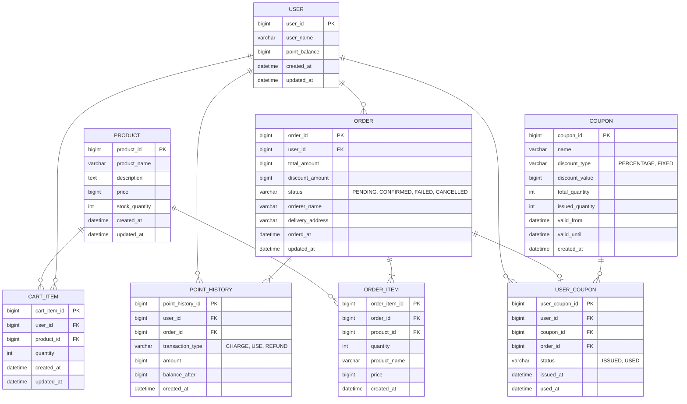

# ERD (Entity Relationship Diagram)

## 엔티티 관계도



## 테이블 상세 설명

### 1. USER (사용자)
- **Primary Key**: user_id
- **Description**: 사용자 정보를 저장하는 테이블
- **Fields**:
  - name: 사용자의 이름
  - point_balance: 사용자의 현재 포인트 잔액

### 2. ORDER (주문)
- **Primary Key**: order_id
- **Foreign Keys**: user_id → USER
- **Description**: 주문 정보 테이블
- **Fields**:
  - total_amount: 총 주문 금액
  - discount_amount: 쿠폰 할인 금액
  - status: 주문 상태
  - orderer_name: 주문자명
  - delivery_address: 배송지 주소
- **Status Values**:
  - PENDING (대기 - 주문 생성됨, 재고/쿠폰 차감됨)
  - CONFIRMED (완료 - 결제 완료)
  - FAILED (실패 - 결제 실패, 재고/쿠폰 복원됨)
  - CANCELLED (취소 - 사용자 취소)

### 3. PRODUCT (상품)
- **Primary Key**: product_id
- **Description**: 판매 상품 정보 테이블
- **Fields**:
  - product_name: 상품명
  - description: 상품 설명
  - price: 상품 가격
  - stock_quantity: 재고 수량
- **Note**:
  - stock_quantity는 재고 관리에 사용되며, 주문 시 차감됨
  - 카테고리 기능은 요구사항에 따라 생략됨

### 4. CART_ITEM (장바구니 항목)
- **Primary Key**: cart_item_id
- **Foreign Keys**:
  - user_id → USER
  - product_id → PRODUCT
- **Description**: 사용자의 장바구니 항목
- **Fields**:
  - quantity: 장바구니에 담은 수량
- **Note**: 같은 사용자-상품 조합은 유니크해야 함 (quantity로 수량 관리)

### 5. ORDER_ITEM (주문 상품)
- **Primary Key**: order_item_id
- **Foreign Keys**:
  - order_id → ORDER
  - product_id → PRODUCT
- **Description**: 주문에 포함된 개별 상품 정보
- **Fields**:
  - quantity: 주문 수량
  - product_name: 주문 당시 상품명 (스냅샷)
  - price: 주문 당시 상품 가격 (스냅샷)
- **Note**:
  - name과 price는 주문 당시의 값을 저장 (가격/상품명 변동 이력 보존)
  - 인기 상품 통계는 ORDER_ITEM의 created_at을 기준으로 집계

### 6. POINT_HISTORY (포인트 거래 이력)
- **Primary Key**: point_history_id
- **Foreign Keys**:
  - user_id → USER
  - order_id → ORDER (결제 시, nullable)
- **Description**: 포인트 충전/사용 이력 추적 테이블
- **Transaction Type Values**:
  - CHARGE (충전)
  - USE (사용)
  - REFUND (환불)
- **Fields**:
  - transaction_type: 거래 유형
  - amount: 거래 금액 (충전/환불은 양수, 사용은 음수)
  - balance_after: 거래 후 잔액 (포인트 이력 추적 및 검증용)
- **Note**:
  - 포인트 사용 내역 조회 가능
  - 감사(audit) 추적 및 포인트 정합성 검증에 활용
  - USER.point와 함께 사용하여 이중 검증

### 7. COUPON (쿠폰)
- **Primary Key**: coupon_id
- **Description**: 쿠폰 마스터 정보 테이블
- **Discount Type Values**:
  - PERCENTAGE (퍼센트 할인)
  - FIXED (고정 금액 할인)
- **Fields**:
  - name: 쿠폰명
  - discount_type: 할인 유형
  - discount_value: 할인 값 (퍼센트 또는 고정 금액)
  - total_quantity: 총 발급 가능 수량
  - issued_quantity: 현재까지 발급된 수량 (선착순 제어용)
  - valid_from: 쿠폰 유효 시작일
  - valid_until: 쿠폰 유효 종료일

### 8. USER_COUPON (사용자 쿠폰)
- **Primary Key**: user_coupon_id
- **Foreign Keys**:
  - user_id → USER
  - coupon_id → COUPON
  - order_id → ORDER (사용 시, nullable)
- **Description**: 사용자별 쿠폰 발급 및 사용 이력
- **Status Values**:
  - ISSUED (발급됨)
  - USED (사용됨)
- **Fields**:
  - status: 쿠폰 상태
  - issued_at: 발급 일시
  - used_at: 사용 일시
- **Note**:
  - 한 사용자는 같은 쿠폰을 한 번만 발급받을 수 있음 (user_id, coupon_id 조합 유니크)
  - 주문 생성 시 쿠폰을 사용 처리하고, 결제 실패 시 복원

## 인덱스 설계

```sql
-- CART_ITEM
CREATE INDEX idx_cart_user ON CART_ITEM(user_id);
CREATE UNIQUE INDEX idx_cart_user_product ON CART_ITEM(user_id, product_id);

-- ORDER
CREATE INDEX idx_order_user ON ORDER(user_id);
CREATE INDEX idx_order_status ON ORDER(status);
CREATE INDEX idx_order_date ON ORDER(orderd_at);

-- ORDER_ITEM
CREATE INDEX idx_order_item_order ON ORDER_ITEM(order_id);
CREATE INDEX idx_order_item_product ON ORDER_ITEM(product_id);
CREATE INDEX idx_order_item_created ON ORDER_ITEM(created_at); -- 인기 상품 통계용

-- POINT_HISTORY
CREATE INDEX idx_point_history_user ON POINT_HISTORY(user_id);
CREATE INDEX idx_point_history_user_created ON POINT_HISTORY(user_id, created_at); -- 사용자별 이력 조회 최적화

-- COUPON
CREATE INDEX idx_coupon_valid_period ON COUPON(valid_from, valid_until);

-- USER_COUPON
CREATE INDEX idx_user_coupon_user ON USER_COUPON(user_id);
CREATE INDEX idx_user_coupon_coupon ON USER_COUPON(coupon_id);
CREATE INDEX idx_user_coupon_status ON USER_COUPON(status);
CREATE UNIQUE INDEX idx_user_coupon_unique ON USER_COUPON(user_id, coupon_id); -- 중복 발급 방지
```

## 비즈니스 로직 노트

### 주문 및 결제 프로세스
1. **주문 생성 (트랜잭션)**
   - 재고 차감 (PRODUCT.stock_quantity)
   - 쿠폰 사용 처리 (USER_COUPON.status = USED, used_at 설정)
   - 주문 생성 (ORDER.status = PENDING)
   - ORDER_ITEM 생성 (주문 당시 상품명/가격 스냅샷)

2. **포인트 결제 처리 (트랜잭션)**
   - 포인트 잔액 검증 (USER.point >= 결제 금액)
   - 포인트 차감 (USER.point)
   - 포인트 이력 생성 (POINT_HISTORY: transaction_type = USE, amount = -결제금액)
   - 성공: ORDER.status = CONFIRMED
   - 실패: 보상 트랜잭션 (재고 복원, 쿠폰 복원, 포인트 복원, ORDER.status = FAILED)

### 쿠폰 발급 프로세스 (선착순)
1. COUPON.issued_quantity < COUPON.total_quantity 체크 (낙관적 락)
2. USER_COUPON에 중복 발급 체크 (UNIQUE 인덱스)
3. COUPON.issued_quantity 증가
4. USER_COUPON 생성 (status = ISSUED, issued_at 설정)
5. 쿠폰 유효기간 체크 (valid_from <= NOW() <= valid_until)

### 포인트 관리 프로세스
1. **포인트 조회**
   - 현재 잔액: USER.point 조회
   - 거래 이력: POINT_HISTORY 조회 (user_id 기준)

2. **포인트 충전**
   - USER.point 증가
   - POINT_HISTORY 생성 (transaction_type = CHARGE)

3. **포인트 사용**
   - 결제 시 USER.point 차감
   - POINT_HISTORY 생성 (transaction_type = USE)

4. **포인트 환불**
   - USER.point 증가
   - POINT_HISTORY 생성 (transaction_type = REFUND)

### 인기 상품 통계
- ORDER_ITEM 테이블에서 created_at 기준 최근 3일 데이터 집계
- product_id별 quantity 합산 후 상위 5개 조회

```sql
SELECT
    op.product_id,
    p.product_name,
    SUM(op.quantity) as total_quantity
FROM ORDER_ITEM op
JOIN PRODUCT p ON op.product_id = p.product_id
WHERE op.created_at >= DATE_SUB(NOW(), INTERVAL 3 DAY)
GROUP BY op.product_id, p.product_name
ORDER BY total_quantity DESC
LIMIT 5;
```