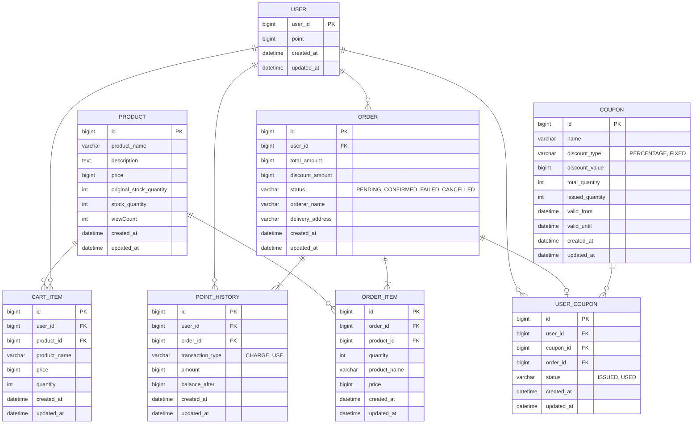

# ERD (Entity Relationship Diagram)

## 엔티티 관계도

```mermaid
erDiagram
    PRODUCT ||--o{ ORDER_ITEM : ""
    PRODUCT ||--o{ CART_ITEM : ""
    
    USER ||--o{ ORDER : ""
    USER ||--o{ CART_ITEM : ""
    USER ||--o{ USER_COUPON : ""
    USER ||--o{ POINT_HISTORY : ""

    ORDER ||--|{ ORDER_ITEM : ""
    ORDER ||--o| USER_COUPON : ""
    ORDER ||--|{ POINT_HISTORY : ""

    COUPON ||--o{ USER_COUPON : ""

    USER {
        bigint user_id PK
        bigint point
        datetime created_at
        datetime updated_at
    }

    ORDER {
        bigint id PK
        bigint user_id FK
        bigint total_amount
        bigint discount_amount
        varchar status "PENDING, CONFIRMED, FAILED, CANCELLED"
        varchar orderer_name
        varchar delivery_address
        datetime created_at
        datetime updated_at
    }

    PRODUCT {
        bigint id PK
        varchar product_name
        text description
        bigint price
        int original_stock_quantity
        int stock_quantity
        int viewCount
        datetime created_at
        datetime updated_at
    }

    CART_ITEM {
        bigint id PK
        bigint user_id FK
        bigint product_id FK
        varchar product_name
        bigint price
        int quantity
        datetime created_at
        datetime updated_at
    }

    ORDER_ITEM {
        bigint id PK
        bigint order_id FK
        bigint product_id FK
        int quantity
        varchar product_name
        bigint price
        datetime created_at
        datetime updated_at
    }

    POINT_HISTORY {
        bigint id PK
        bigint user_id FK
        bigint order_id FK
        varchar transaction_type "CHARGE, USE"
        bigint amount
        bigint balance_after
        datetime created_at
        datetime updated_at
    }

    COUPON {
        bigint id PK
        varchar name
        varchar discount_type "PERCENTAGE, FIXED"
        bigint discount_value
        int total_quantity
        int issued_quantity
        datetime valid_from
        datetime valid_until
        datetime created_at
        datetime updated_at
    }

    USER_COUPON {
        bigint id PK
        bigint user_id FK
        bigint coupon_id FK
        bigint order_id FK
        varchar status "ISSUED, USED"
        datetime created_at
        datetime updated_at
    }
```