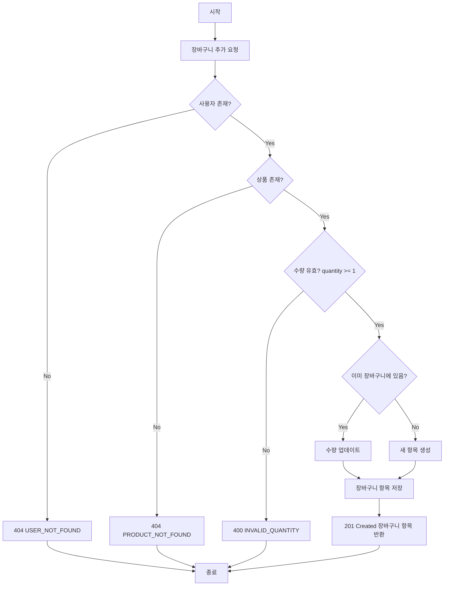
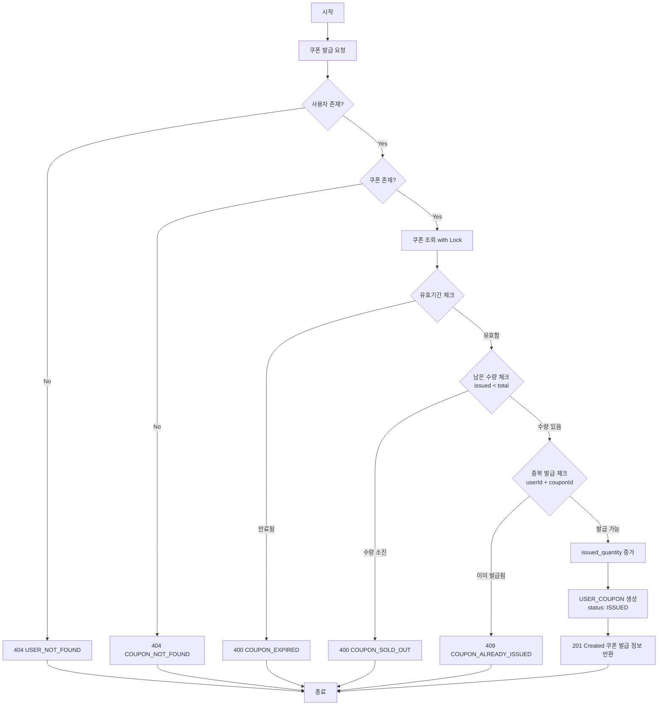
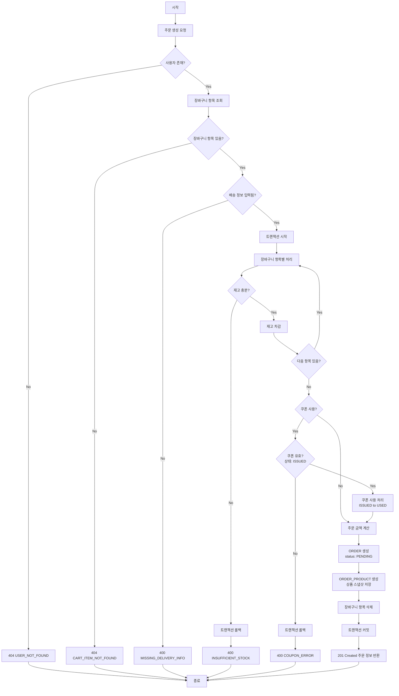
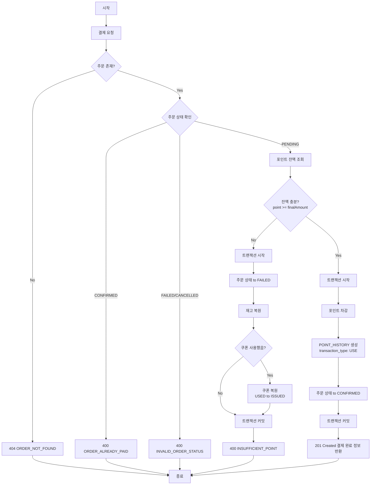

# 플로우차트

## 1. 장바구니 추가

```mermaid
flowchart TD
    A[시작] --> B[장바구니 추가 요청]
    B --> C{사용자 존재?}
    C -->|No| D[404 USER_NOT_FOUND]
    D --> E[종료]
    C -->|Yes| F{상품 존재?}
    F -->|No| G[404 PRODUCT_NOT_FOUND]
    G --> E
    F -->|Yes| H{수량 유효? quantity >= 1}
    H -->|No| I[400 INVALID_QUANTITY]
    I --> E
    H -->|Yes| J{이미 장바구니에 있음?}
    J -->|Yes| K[수량 업데이트]
    J -->|No| L[새 항목 생성]
    K --> M[장바구니 항목 저장]
    L --> M
    M --> N[201 Created 장바구니 항목 반환]
    N --> E
```

## 2. 쿠폰 발급 (선착순)

```mermaid
flowchart TD
    A[시작] --> B[쿠폰 발급 요청]
    B --> C{사용자 존재?}
    C -->|No| D[404 USER_NOT_FOUND]
    D --> E[종료]
    C -->|Yes| F{쿠폰 존재?}
    F -->|No| G[404 COUPON_NOT_FOUND]
    G --> E
    F -->|Yes| H[쿠폰 조회 with Lock]
    H --> I{유효기간 체크}
    I -->|만료됨| J[400 COUPON_EXPIRED]
    J --> E
    I -->|유효함| K{남은 수량 체크<br/>issued < total}
    K -->|수량 소진| L[400 COUPON_SOLD_OUT]
    L --> E
    K -->|수량 있음| M{중복 발급 체크<br/>userId + couponId}
    M -->|이미 발급됨| N[409 COUPON_ALREADY_ISSUED]
    N --> E
    M -->|발급 가능| O[issued_quantity 증가]
    O --> P[USER_COUPON 생성<br/>status: ISSUED]
    P --> Q[201 Created 쿠폰 발급 정보 반환]
    Q --> E
```

## 3. 주문 생성

```mermaid
flowchart TD
    A[시작] --> B[주문 생성 요청]
    B --> C{사용자 존재?}
    C -->|No| D[404 USER_NOT_FOUND]
    D --> E[종료]
    C -->|Yes| F[장바구니 항목 조회]
    F --> G{장바구니 항목 있음?}
    G -->|No| H[404 CART_ITEM_NOT_FOUND]
    H --> E

    G -->|Yes| I{배송 정보 입력됨?}
    I -->|No| J[400 MISSING_DELIVERY_INFO]
    J --> E

    I -->|Yes| K[트랜잭션 시작]
    K --> L[장바구니 항목별 처리]

    L --> M{재고 충분?}
    M -->|No| N[트랜잭션 롤백]
    N --> O[400 INSUFFICIENT_STOCK]
    O --> E

    M -->|Yes| P[재고 차감]
    P --> Q{다음 항목 있음?}
    Q -->|Yes| L

    Q -->|No| R{쿠폰 사용?}
    R -->|No| W[주문 금액 계산]

    R -->|Yes| S{쿠폰 유효?<br/>상태: ISSUED}
    S -->|No| T[트랜잭션 롤백]
    T --> U[400 COUPON_ERROR]
    U --> E

    S -->|Yes| V[쿠폰 사용 처리<br/>ISSUED to USED]
    V --> W

    W --> X[ORDER 생성<br/>status: PENDING]
    X --> Y[ORDER_PRODUCT 생성<br/>상품 스냅샷 저장]
    Y --> Z[장바구니 항목 삭제]
    Z --> AA[트랜잭션 커밋]
    AA --> AB[201 Created 주문 정보 반환]
    AB --> E
```

## 4. 결제 처리

```mermaid
flowchart TD
    A[시작] --> B[결제 요청]
    B --> C{주문 존재?}
    C -->|No| D[404 ORDER_NOT_FOUND]
    D --> E[종료]

    C -->|Yes| F{주문 상태 확인}
    F -->|CONFIRMED| G[400 ORDER_ALREADY_PAID]
    G --> E
    F -->|FAILED/CANCELLED| H[400 INVALID_ORDER_STATUS]
    H --> E

    F -->|PENDING| I[포인트 잔액 조회]
    I --> J{잔액 충분?<br/>point >= finalAmount}

    J -->|No| K[트랜잭션 시작]
    K --> L[주문 상태 to FAILED]
    L --> M[재고 복원]
    M --> N{쿠폰 사용했음?}
    N -->|Yes| O[쿠폰 복원<br/>USED to ISSUED]
    N -->|No| P[트랜잭션 커밋]
    O --> P
    P --> Q[400 INSUFFICIENT_POINT]
    Q --> E

    J -->|Yes| R[트랜잭션 시작]
    R --> S[포인트 차감]
    S --> T[POINT_HISTORY 생성<br/>transaction_type: USE]
    T --> U[주문 상태 to CONFIRMED]
    U --> V[트랜잭션 커밋]
    V --> W[201 Created 결제 완료 정보 반환]
    W --> E
```