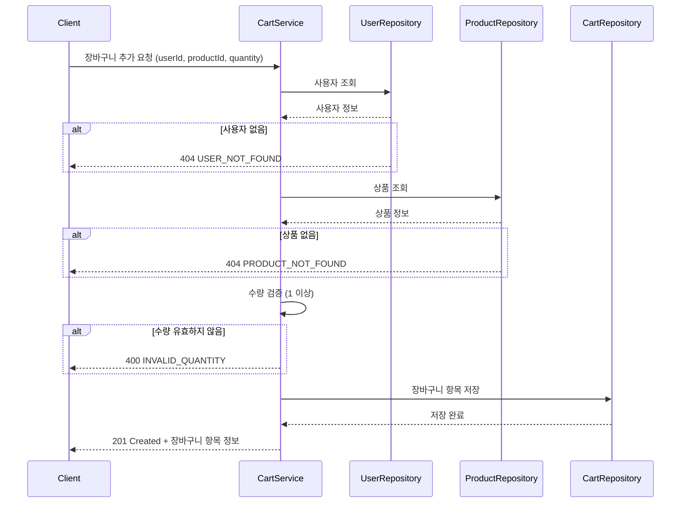
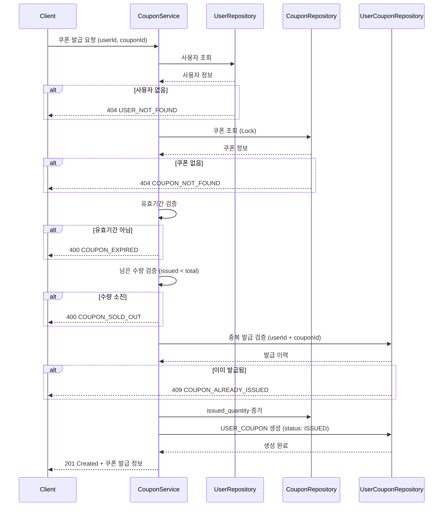
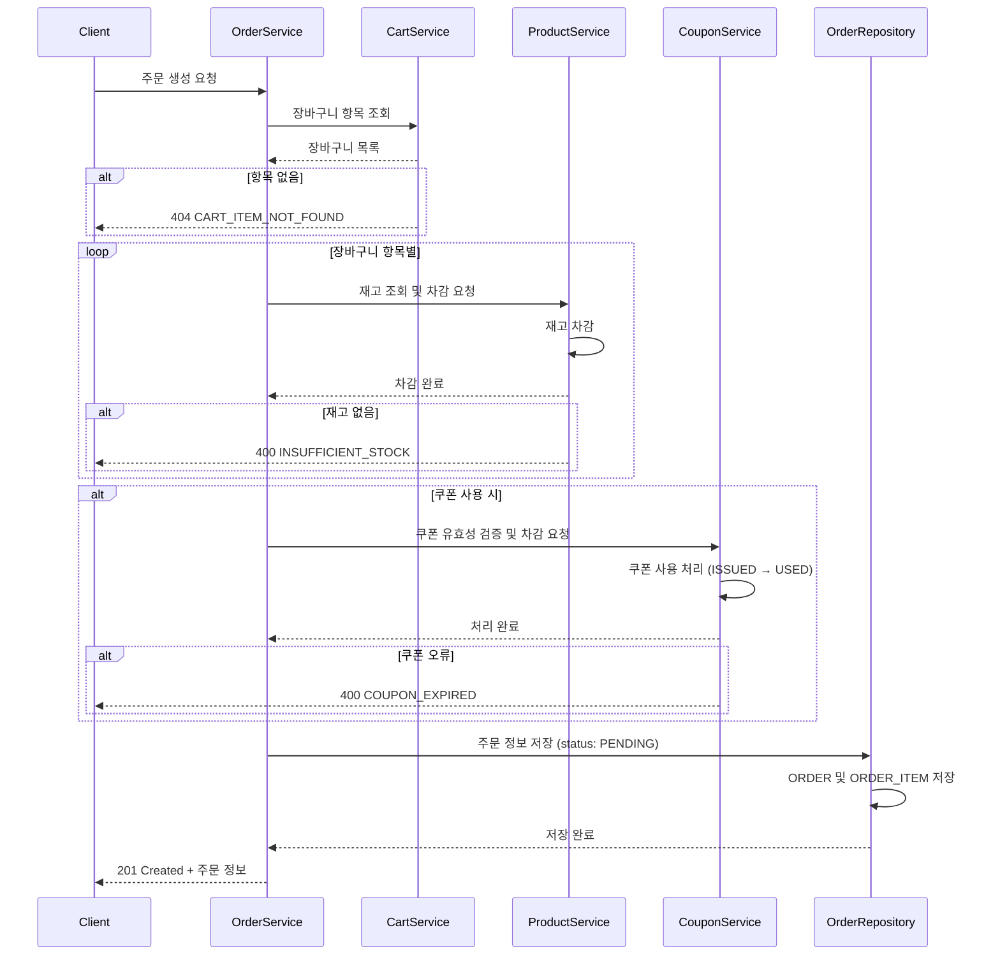
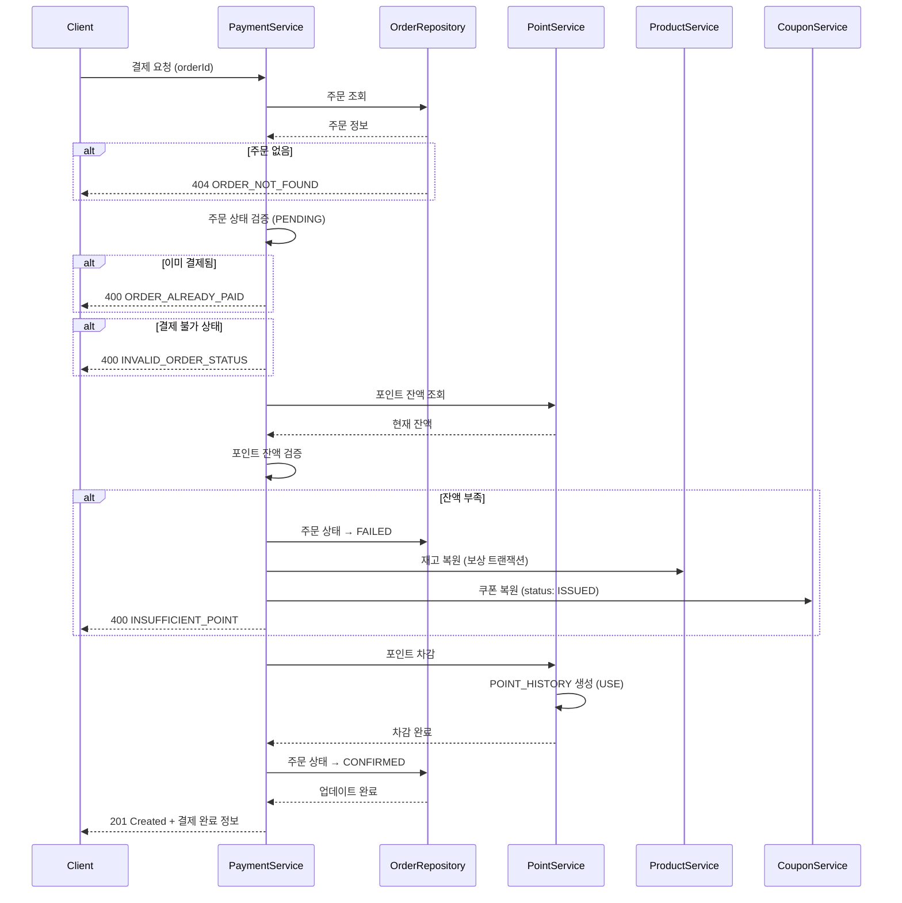

# 시퀀스 다이어그램

## 장바구니 추가

```mermaid
sequenceDiagram
    participant Client
    participant CartService
    participant UserRepository
    participant ProductRepository
    participant CartRepository

    Client->>CartService: 장바구니 추가 요청 (userId, productId, quantity)

    CartService->>UserRepository: 사용자 조회
    UserRepository-->>CartService: 사용자 정보
    alt 사용자 없음
        UserRepository-->>Client: 404 USER_NOT_FOUND
    end

    CartService->>ProductRepository: 상품 조회
    ProductRepository-->>CartService: 상품 정보
    alt 상품 없음
        ProductRepository-->>Client: 404 PRODUCT_NOT_FOUND
    end

    CartService->>CartService: 수량 검증 (1 이상)
    alt 수량 유효하지 않음
        CartService-->>Client: 400 INVALID_QUANTITY
    end

    CartService->>CartRepository: 장바구니 항목 저장
    CartRepository-->>CartService: 저장 완료

    CartService-->>Client: 201 Created + 장바구니 항목 정보
```

## 쿠폰 발급

```mermaid
sequenceDiagram
    participant Client
    participant CouponService
    participant UserRepository
    participant CouponRepository
    participant UserCouponRepository

    Client->>CouponService: 쿠폰 발급 요청 (userId, couponId)

    CouponService->>UserRepository: 사용자 조회
    UserRepository-->>CouponService: 사용자 정보
    alt 사용자 없음
        UserRepository-->>Client: 404 USER_NOT_FOUND
    end

    CouponService->>CouponRepository: 쿠폰 조회 (Lock)
    CouponRepository-->>CouponService: 쿠폰 정보
    alt 쿠폰 없음
        CouponRepository-->>Client: 404 COUPON_NOT_FOUND
    end

    CouponService->>CouponService: 유효기간 검증
    alt 유효기간 아님
        CouponService-->>Client: 400 COUPON_EXPIRED
    end

    CouponService->>CouponService: 남은 수량 검증 (issued < total)
    alt 수량 소진
        CouponService-->>Client: 400 COUPON_SOLD_OUT
    end

    CouponService->>UserCouponRepository: 중복 발급 검증 (userId + couponId)
    UserCouponRepository-->>CouponService: 발급 이력
    alt 이미 발급됨
        UserCouponRepository-->>Client: 409 COUPON_ALREADY_ISSUED
    end

    CouponService->>CouponRepository: issued_quantity 증가
    CouponService->>UserCouponRepository: USER_COUPON 생성 (status: ISSUED)
    UserCouponRepository-->>CouponService: 생성 완료

    CouponService-->>Client: 201 Created + 쿠폰 발급 정보
```

## 주문 생성

```mermaid
sequenceDiagram
    participant Client
    participant OrderService
    participant CartService
    participant ProductService
    participant CouponService
    participant OrderRepository

    Client->>OrderService: 주문 생성 요청

    OrderService->>CartService: 장바구니 항목 조회
    CartService-->>OrderService: 장바구니 목록
    alt 항목 없음
        CartService-->>Client: 404 CART_ITEM_NOT_FOUND
    end

    loop 장바구니 항목별
        OrderService->>ProductService: 재고 조회 및 차감 요청
        ProductService->>ProductService: 재고 차감
        ProductService-->>OrderService: 차감 완료
        alt 재고 없음
            ProductService-->>Client: 400 INSUFFICIENT_STOCK
        end
    end

    alt 쿠폰 사용 시
        OrderService->>CouponService: 쿠폰 유효성 검증 및 차감 요청
        CouponService->>CouponService: 쿠폰 사용 처리 (ISSUED → USED)
        CouponService-->>OrderService: 처리 완료
        alt 쿠폰 오류
            CouponService-->>Client: 400 COUPON_EXPIRED
        end
    end

    OrderService->>OrderRepository: 주문 정보 저장 (status: PENDING)
    OrderRepository->>OrderRepository: ORDER 및 ORDER_ITEM 저장
    OrderRepository-->>OrderService: 저장 완료
    OrderService-->>Client: 201 Created + 주문 정보
```

## 결제

```mermaid
sequenceDiagram
    participant Client
    participant PaymentService
    participant OrderRepository
    participant PointService
    participant ProductService
    participant CouponService

    Client->>PaymentService: 결제 요청 (orderId)

    PaymentService->>OrderRepository: 주문 조회
    OrderRepository-->>PaymentService: 주문 정보
    alt 주문 없음
        OrderRepository-->>Client: 404 ORDER_NOT_FOUND
    end

    PaymentService->>PaymentService: 주문 상태 검증 (PENDING)
    alt 이미 결제됨
        PaymentService-->>Client: 400 ORDER_ALREADY_PAID
    end
    alt 결제 불가 상태
        PaymentService-->>Client: 400 INVALID_ORDER_STATUS
    end

    PaymentService->>PointService: 포인트 잔액 조회
    PointService-->>PaymentService: 현재 잔액

    PaymentService->>PaymentService: 포인트 잔액 검증
    alt 잔액 부족
        PaymentService->>OrderRepository: 주문 상태 → FAILED
        PaymentService->>ProductService: 재고 복원 (보상 트랜잭션)
        PaymentService->>CouponService: 쿠폰 복원 (status: ISSUED)
        PaymentService-->>Client: 400 INSUFFICIENT_POINT
    end

    PaymentService->>PointService: 포인트 차감
    PointService->>PointService: POINT_HISTORY 생성 (USE)
    PointService-->>PaymentService: 차감 완료

    PaymentService->>OrderRepository: 주문 상태 → CONFIRMED
    OrderRepository-->>PaymentService: 업데이트 완료

    PaymentService-->>Client: 201 Created + 결제 완료 정보
```